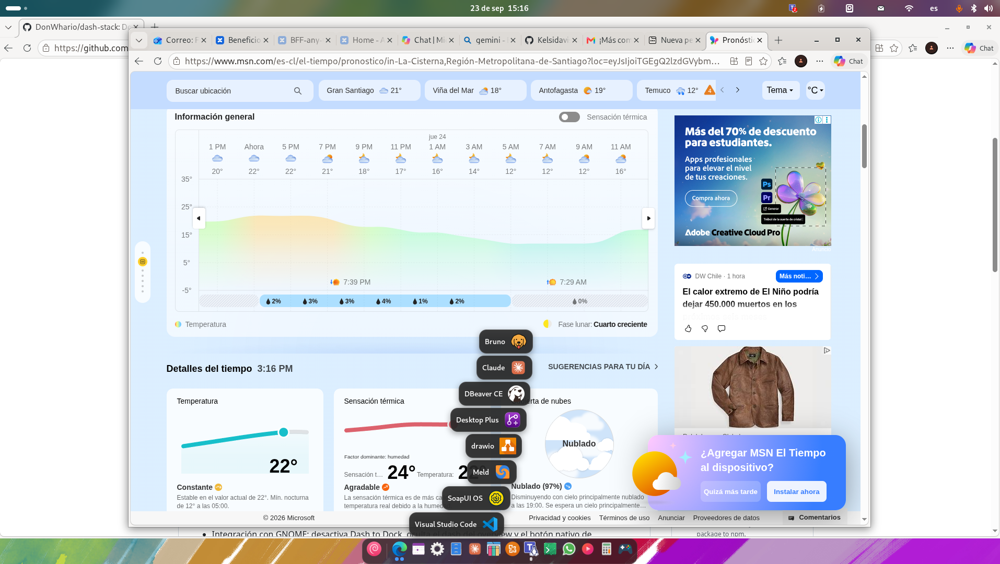

# Dock Stack

Dock inferior para **GNOME Shell 48** (Wayland) con agrupaciones de aplicaciones
estilo macOS (*stacks*), rejilla de aplicaciones propia (*Launchpad*), barra de
tareas con apps en ejecución e iconos de bandeja (*systray*) en el panel superior.

> Extensión personal de *Aplicaciones y Utilitarios — ABAZA*.

## Características

- **Dock** inferior configurable (tamaño de icono, opacidad, posición, reserva de espacio).
- **Stacks estilo macOS**: agrupaciones de apps o carpetas que se despliegan en
  **grilla** o en **abanico** (tira curva), con orden ascendente/descendente.
- **Orden unificado**: favoritos y stacks se mezclan y **se reordenan arrastrando**,
  con animación fluida (los iconos se apartan para abrir el hueco).
- **Apps en ejecución** en el dock, agrupadas por aplicación, con puntos indicadores
  y miniaturas de ventanas al pasar el ratón.
- **Rejilla de aplicaciones propia** (*Launchpad*) con categorías, búsqueda,
  ordenación alfabética y tema claro/oscuro, en sustitución del *overview* de GNOME.
- **Systray** propio (StatusNotifierItem/AppIndicator) en el panel superior.
- **Intellihide** y ocultado automático; se oculta en pantalla completa (juegos/vídeo).
- **Sonidos** configurables de inicio y cierre de sesión.
- Integración con GNOME: desactiva Dash to Dock, oculta el dash del overview y el
  botón nativo de aplicaciones mientras está activa.
- Panel de **preferencias** (General / Stacks / Acerca De).

## Captura



## Requisitos

- GNOME Shell **48**
- Sesión **Wayland** (recomendado)

## Instalación

### Desde el paquete (.zip)

```bash
gnome-extensions install --force dock-stack@felipe.local.shell-extension.zip
```

Cierra sesión y vuelve a entrar, luego actívala:

```bash
gnome-extensions enable dock-stack@felipe.local
```

### Desde el código (clonando el repositorio)

```bash
git clone https://github.com/DonWhario/dash-stack.git \
  ~/.local/share/gnome-shell/extensions/dock-stack@felipe.local
cd ~/.local/share/gnome-shell/extensions/dock-stack@felipe.local
make schemas          # compila los esquemas de GSettings
gnome-extensions enable dock-stack@felipe.local
```

Cierra sesión y vuelve a entrar para que GNOME Shell la cargue.

## Desarrollo

```bash
make schemas   # compilar esquemas tras editar el .gschema.xml
make pack      # generar el .zip
make install   # empaquetar e instalar
```

Probar sin cerrar sesión (sesión anidada):

```bash
dbus-run-session -- gnome-shell --nested --wayland
```

Diagnóstico en vivo:

```bash
journalctl -f -o cat /usr/bin/gnome-shell
```

## Estructura

| Archivo | Descripción |
|---|---|
| `extension.js` | Lógica principal: dock, stacks, rejilla, intellihide, integración. |
| `systray.js`   | Host de StatusNotifierItem/AppIndicator para los iconos de bandeja. |
| `prefs.js`     | Panel de preferencias (Adw). |
| `stylesheet.css` | Estilos del dock, stacks, rejilla y miniaturas. |
| `schemas/`     | Esquema de GSettings. |

## Licencia

[MIT](LICENSE) © 2026 Felipe Abarca
